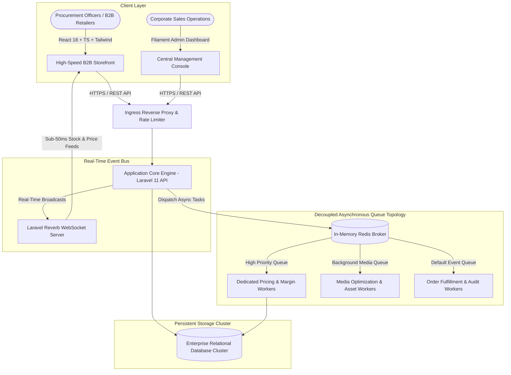

# 🏬 High-Throughput B2B Wholesale Trading & Dynamic Inventory Engine
### *Event-Driven, Asynchronous Queue Architecture for Large-Scale Wholesale Distributors*

---

  <b>An enterprise wholesale trading platform engineered to process high-volume bulk catalog orders, real-time tiered margin calculations, and continuous inventory synchronization under extreme traffic concurrency.</b>

---

## 🏛️ Executive Architectural Overview

Wholesale (B2B) commerce platforms face architectural demands fundamentally different from standard B2C retail: massive product catalogs (tens of thousands of SKUs), customer-segmented multi-tier pricing structures, credit-limit checks, bulk CSV/Excel order imports, and sudden flash ordering spikes from corporate procurement departments.

The **High-Throughput B2B Trading Engine** solves these challenges through an **Event-Driven, Queue-Decoupled Architecture**. By separating real-time customer transactions from compute-heavy catalog indexing and media pipelines, the core ordering gateway maintains sub-millisecond responsiveness even while processing massive asynchronous data synchronizations in the background.

---

## ⚡ Core Technical Capabilities & Benchmarks

### 1. Decoupled Asynchronous Queue Topology
- **Isolated Queue Priority Pipelines:**
  - **`prices` Worker Queue:** Dedicated high-priority worker pool handling customer-tier price recalibrations and bulk spreadsheet updates without blocking transaction processing.
  - **`media` Worker Queue:** Isolated compute workers performing image optimization and progressive asset transcoding.
  - **`default` Worker Queue:** Order notifications, PDF invoice generation, and audit logging.
- **Supervisor-Orchestrated Daemon Mesh:** Ensures worker processes auto-heal, scale during traffic spikes, and restart seamlessly without dropped job payloads.

### 2. Multi-Tier Dynamic B2B Pricing Engine
- **Customer-Segmented Rate Evaluation:** High-speed calculation of dynamic wholesale prices based on buyer credit tiers, bulk pack volume thresholds, and contract-specific discount schedules.
- **Race-Condition-Free Inventory Reservation:** Pessimistic locking strategies at the database level ensure corporate buyers cannot over-allocate limited warehouse stock during simultaneous high-volume checkout rushes.

### 3. Sub-50ms Live Inventory & Price Broadcasts
- **Persistent Laravel Reverb WebSockets:** When warehouse stock changes or flash wholesale promotions update, the new availability is pushed instantly to all connected procurement screens via WebSockets without client polling.

---

## 🛡️ Security & Enterprise Standards

- **Tenant & Role-Based Access Control:** Strict authorization isolating corporate account managers from internal administrative controls.
- **Cryptographic Session & Token Security:** Ephemeral tokens with scoped permissions for client procurement APIs.
- **Zero Raw SQL Ingestion:** Strict ORM and typed schema mappings preventing injection vulnerabilities across catalog and ordering pipelines.

---

## 📐 System Specifications Matrix

| Dimension | Specification |
| :--- | :--- |
| **Backend Core** | Laravel 11 Enterprise (PHP 8.3+) |
| **Administration Console**| Filament Admin 3.x (Resource-based live data tables) |
| **Frontend Storefront** | React 18, TypeScript, Vite, Tailwind CSS |
| **Queue Broker** | Redis In-Memory Key-Value Store & Message Broker |
| **Real-Time Gateway** | Laravel Reverb WebSockets |
| **Concurrency SLA** | Zero lock contention on 10,000+ simultaneous cart evaluations |
| **API Latency** | Sub-15ms standard response time for authenticated B2B catalog queries |

---

## 🔒 Confidentiality & Institutional Licensing Notice

> [!NOTE]
> **Proprietary Enterprise Architecture:**
> This repository documents the public architectural design, queue topologies, and system specifications of the B2B Wholesale Trading Engine engineered by **Apex Agency**. In strict compliance with institutional NDAs, production source code, commercial client credentials, proprietary margin algorithms, and partner ERP credentials have been scrubbed.
> 
> Enterprise licensing, custom ERP integrations, and white-label trading platforms are delivered under formal commercial agreements.
> 
> **Inquiries & Architectural Consulting:** [contact@apex-agency.tech](mailto:contact@apex-agency.tech) | [https://apex-agency.tech](https://apex-agency.tech)
